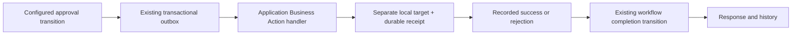

# Golden #4 — controlled local Business Action

Checkpoint: 7 October 2026. **PASS against a separate fictional local target. No real internal-system integration.**

## Working demo

- Application: http://127.0.0.1:5080
- Completed example: http://127.0.0.1:5080/cases/15
- Sign in as **נועה לוי** to see the external result and public updates.
- To repeat: open an inquiry, choose **בקשה לשינוי כתובת — הדגמה מקומית**, enter a fictional address, save and submit. Switch to **יעל ישראלי**, open the same inquiry from the queue, enter an approval reason and choose **אישור ועדכון הכתובת**. The waiting page offers **בדיקת עדכון**. Switch back to the original external user and reload.
- Initial local demonstration: **רחוב הדוגמה 10, עיר ניסוי → רחוב העתיד 40, עיר דמיונית**. Existing Provider records are unchanged; the address belongs to the fictional target only.

## Small generic extension



- `Transition.businessAction` selects a registered operation, maps handler input names to configured form-field keys, and identifies existing success/failure transitions.
- `Transition.trigger` defaults to `user` for all old definitions. `businessSuccess` / `businessFailure` mark worker-only completion transitions; they are hidden from user actions and rejected by the action API.
- The existing inquiry remains the only workflow instance and source of current state. No replacement engine, duplicated state model, new permission or database migration was added.
- Approval and its immutable input/actor/provider snapshot are committed in the existing outbox transaction. The job and eventual structured result are stored in `Outbox.Message` for `Kind=businessAction`.
- Address rules and mutation live in `Infrastructure/LocalAddressTarget.cs`, outside the workflow engine. The generic dispatcher is `Infrastructure/BusinessActions.cs`.
- Completion invokes `Engine.Execute`; result, next workflow state, history, notification and outbox acknowledgement commit together. Public business results reuse the existing response/history UI; private approval notes remain private.

Example binding in the published definition:

```json
{
  "businessAction": {
    "key": "changeAddress",
    "inputs": { "address": "requestedAddress" },
    "success": "completed",
    "failure": "rejected"
  }
}
```

The two destination transitions originate in the configured waiting state and use `trigger: businessSuccess` / `businessFailure`. Publication validates registered operations, required input bindings and the two automatic result transitions. Waiting-state fields cannot be editable. The initial user submission still uses the existing submission guard.

## Safety and delivery

- The address handler is registered only in Development + Demo mode. Production has no real business-action handler or endpoint to a real target.
- The target is `server/App_Data/fictional-addresses.db`; QA has its own database under `work/checkpoint-server/App_Data`. It is separate from `demo.db`.
- Provider identity comes from the authorized inquiry, not a form field. Target setup requires a local HQ administrator; target/result reads enforce existing ownership and organization scopes.
- The worker rechecks the approving account's active status, role and write scope before a fresh operation. A prior committed receipt is recovered before this check so permission changes cannot turn a completed mutation into a false failure report.
- The stable outbox ID identifies the operation. The target updates the address, increments its change count and stores the receipt in one SQLite transaction. Repeated delivery returns the original receipt; a reused operation key with different inputs is rejected.
- Definitive rejection runs the configured failure transition and reports that no change occurred. Technical errors retry with existing backoff. At five failed deliveries the job is `blocked`, the inquiry stays waiting, and the UI requests investigation. An uncertain outcome is never presented as successful or as a confirmed rejection.
- Demo target modes are `normal`, `reject`, and `interruptOnce`. The last commits the target update and then throws before platform acknowledgement, proving recovery of the committed receipt.

## Evidence

| Proof | Result | Evidence |
|---|---|---|
| Success, actual before/after, external reload | PASS | `business-actions/browser-normal.json`, inquiry #46 in QA |
| Definitive failure, no address mutation | PASS | `business-actions/browser-reject.json`, inquiry #44 |
| Interruption after target commit, retry, exactly one target change | PASS | `business-actions/browser-interruptOnce.json`, inquiry #45; one retry, one result |
| Guards, ownership, automatic-transition API denial, duplicate approval rejection | PASS | `business-actions/api-results.json` |
| Different process key and input-field key use the same handler | PASS | API alias inquiry #41, mapped from `postalLocation` |
| Results survive server restart | PASS | `business-actions/restart-validation.json` |
| Main local demonstration | PASS | `business-actions/live-demo.json`, inquiry #15 on port 5080 |
| Existing required-document browser journey | PASS | `business-actions/required-document-regression.json`, inquiry #51 |
| Existing authorization / document validation / presentation / history privacy | PASS | 10 authorization, 11 document/access, 10 presentation checks; history privacy scenario |
| Backend / strict minified frontend builds | PASS | No errors. Backend retains the known NU1900 package-audit-feed warning. |

Browser E2E uses real UI controls, API, persistence, worker and target. No direct database workflow/status writes, mocks or API substitution for browser transitions. Actual target reads independently verify each browser outcome and change count. API tests also observed the target commit while the inquiry was still waiting.

Rendered final result inspected at 1440 / 768 / 375px; tablet and mobile had no page-level horizontal overflow. Screenshots: `business-actions/desktop-final.png`, `tablet-final.png`, `mobile-final.png`. Pending, rejection and retry screenshots are in the same folder. New UI reuses the approved gov-il-ui typography, section and secondary-button styles; no redesign or new CSS system.

## Running checks

Run mutation-producing tests only against isolated QA on port 5081:

```powershell
& 'C:/Users/shapira/.cache/codex-runtimes/codex-primary-runtime/dependencies/python/python.exe' checks/business-actions.py http://127.0.0.1:5081
```

`checks/business-actions-flow.mjs` is the browser scenario used through the supported in-app Playwright-compatible adapter. `checks/business-actions.e2e.spec.cjs` adds normal Playwright scenarios including target assertions; its dedicated configuration is `checks/business-actions.playwright.cjs`. Run that configuration after the API setup in an environment that can launch Playwright. Default test discovery was left unchanged.

Standalone Playwright and Angular unit tests retain the existing **spawn EPERM** environment limitation. Their assertions were not weakened, and standalone CLI execution is not reported as passing. No new axe certification is claimed; rendered RTL/layout and existing control semantics were reviewed.

Current main startup, from `server/`:

```powershell
$env:ASPNETCORE_ENVIRONMENT='Development'
$env:Demo='true'
& 'C:/Program Files/dotnet/dotnet.exe' ../../../work/business-actions-checkpoint/Workflow.Api.dll --urls http://127.0.0.1:5080
```

## Deliberate limits

- One local handler with required text/textarea input mappings. No real credentials, integrations, scripts or speculative action framework.
- The Business Action binding was published using the existing validated process API. The visual editor remains in place and displays the workflow; no new binding-authoring panel was added.
- Reconciliation/retry controls for exhausted or ambiguous jobs are not implemented. The blocked state is visible and retained; the five-attempt exhaustion path is implemented but was not exhaustively timed in this E2E.
- The local target serializes writes, but different operations can update the same address in succession. A real adapter would need explicit target concurrency and ordering rules.
- Preserve both local databases when backing up the demonstration; target receipts are part of idempotency evidence.
- Historic Golden scenarios marked SKIPPED remain historic. The deliberately configured address demo now proves its own no-document journey; it does not retroactively turn those earlier configuration gaps into PASS.
