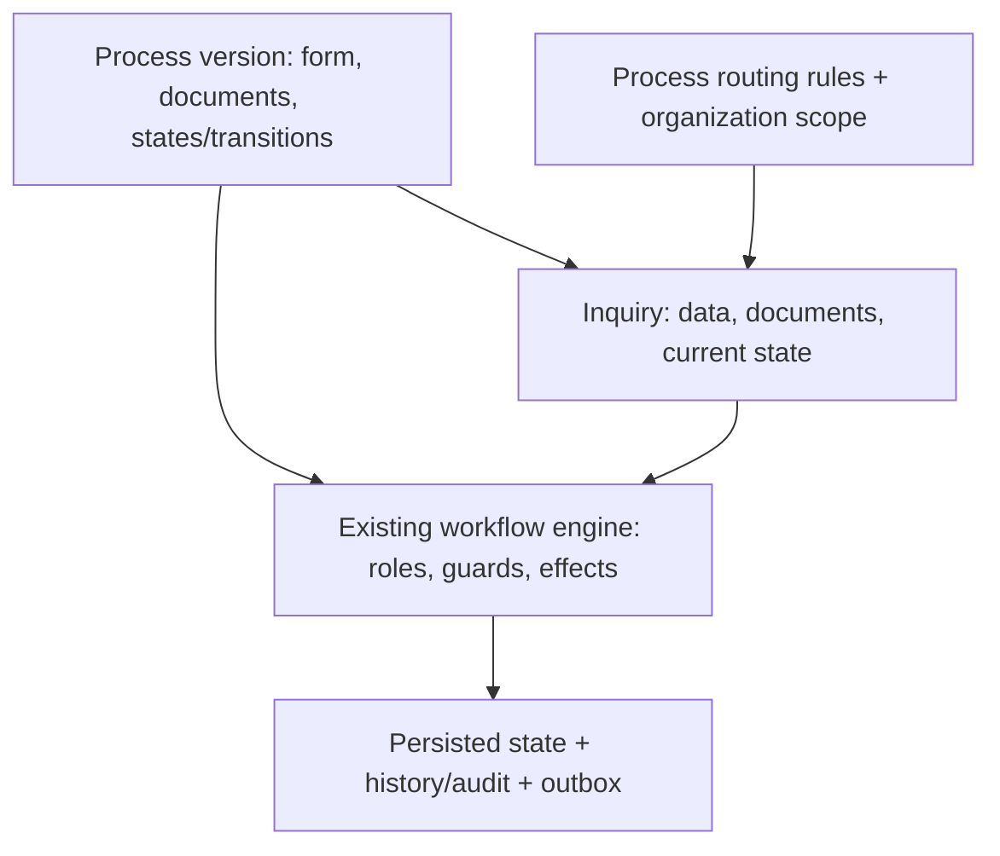

# Demo — current platform checkpoint

## What we built

A configurable inquiry/process platform. Process versions define forms, required documents, workflow states/transitions, transition roles, guards and supported effects. Process-associated routing rules determine the handling unit; account/provider scope determines access. An inquiry retains its process version, payload, current state, document versions and history. This is not one inquiry flow hardcoded into the application.

Effects currently cover review rounds, task closure and queued notifications/mail. Arbitrary business actions and real external mail delivery are not proven capabilities.

## What exists today

PROVEN = exercised by browser E2E or recorded API checks; IMPLEMENTED = present, without a complete Golden journey for every variant; PARTIAL = important capability/coverage remains unfinished.

| Area | Capability | Status |
|---|---|---|
| EXTERNAL USER | Eligible process selection, dynamic form and partial draft | PROVEN |
| EXTERNAL USER | Configured required documents, per-document upload, completion and secure download | PROVEN |
| EXTERNAL USER | Submission, final response/status/documents/history after reload | PROVEN |
| EMPLOYEE / REVIEWER | Scoped queue, opening the same inquiry, treatment, response and workflow closure | PROVEN |
| EMPLOYEE / REVIEWER | Document download and persisted business information | PROVEN |
| EMPLOYEE / REVIEWER | Document-review tasks and guarded review actions | PROVEN in earlier API checks |
| PROCESS / WORKFLOW | Definition/version-driven state machine, roles, guards, payload decisions and audit | PROVEN for recorded scenarios |
| PROCESS / WORKFLOW | Visual workflow editor, inspection and simulation | IMPLEMENTED |
| PROCESS / WORKFLOW | No-document complete external/employee journey and partial process eligibility | PARTIAL: current Golden coverage missing |
| ADMINISTRATION | Process forms/documents/routing, account read/write scopes and organization units | IMPLEMENTED; core rules API-tested |
| ADMINISTRATION | Gov-il-ui foundation across detail/list/form/complex administration | PROVEN by visual review |
| ADMINISTRATION | Complete UI migration, deeper organization browsing and real mail delivery | PARTIAL |

## What is E2E proven

**Required-document inquiry — PASS**

External user → Create Inquiry → dynamic form → draft → configured required documents → upload → submission guard → submit → employee queue → treatment → response → workflow closure → original external user → reload → final status, response, documents and history.

The same authorized creator could continue/upload/submit. Completion counts came from configuration, not a fixed number. Process/version, ownership and routing persisted. Employee/owner downloads matched the uploaded PDFs; unrelated access returned 403.

Initiation authorization **PASS**; backend authorization **PASS**; regression **PASS** (11 server checks + 10 presentation checks in the checkpoint); genericity **PASS**. Golden inquiry #13 was in the isolated QA copy, not the main working database. Earlier main inquiry #7 is an existing closed example.

- Simple/no-document E2E: **SKIPPED — missing existing eligible configuration**.
- Partial process eligibility: **SKIPPED — missing existing configuration**.

SKIPPED is neither PASS nor FAIL. [Golden evidence](golden-checkpoint/browser-result.json), [API/persistence/download evidence](golden-checkpoint/persistence-download.json), [checkpoint summary](golden-checkpoint/results.json).


## Generic model



## Live demo — 5–10 minutes

Use existing **בירור תשלום עבור שירות**, version 2. This is a script for a future live demonstration; no records/configuration were changed while writing it. A live run creates an inquiry and uploads files: use the local demo or a prepared isolated copy. Never edit/publish the process during the demo.

### 1. Process configuration — about one minute

**OPEN:** As מנהל המערכת, open טפסים ותהליכים; select בירור תשלום עבור שירות · גרסה 2.

**SAY:** ״הפנייה אינה תהליך ייעודי שכתוב בקוד. ההגדרה קובעת את ההתנהגות שלה.״

**CLICK:** Inspect פרטי התהליך, מפת התהליך, טופס ומסמכים and ניתוב ליחידות. Select existing transitions to show roles/guards. Do not change, save or publish anything.

**EXPECT:** Existing form fields, חשבונית and אישור ביצוע שירות, configured transitions/roles, and existing routing/default destination are visible. An empty custom-rule list does not mean there is no default routing.

### 2. External user — about three minutes

**OPEN:** Switch to נועה לוי (נותן שירות); open הפניות שלי.

**SAY:** ״אני רואה רק תהליכים שאני רשאית לפתוח. הטופס והמסמכים מגיעים מההגדרה.״

**CLICK:** פתיחת פנייה → בירור תשלום עבור שירות → פרטי הפנייה. Enter a business subject and the displayed required fields; for example amount 1250, a valid service date, a synthetic invoice number and demo@example.org. Click שמירה והמשך → מסמכים. Observe 0/N; upload demo-invoice.pdf for the first requirement (1/N), then demo-service.pdf for the remaining requirement (N/N). Show filename/download links. Click המשך → בדיקה והגשה, review the summary, then הגשת הפנייה. Use חזרה לפרטים or עריכת פרטים when needed; שמירה והמשך updates the same draft and preserves uploads. Note the inquiry number on the resulting detail page.

**EXPECT:** The creator retains access and upload controls. Missing fields/documents explain why submission is blocked. After completion, the existing guard permits submission and the human-readable status becomes הוגשה. Keep the same inquiry number throughout.

### 3. Employee — about two minutes

**OPEN:** Switch to יעל ישראלי (גורם מטפל); open תור פניות.

**SAY:** ״העובד מבצע פעולה עסקית; מנוע התהליך מבצע את המעבר.״

**CLICK:** Search the noted number, open that same inquiry, show business details and document download links, then התחלת טיפול. Enter a meaningful response in מענה או הערה לפעולה; click מענה וסגירת הפנייה.

**EXPECT:** The inquiry moves through configured workflow actions. Closure requires a response; the final status is נסגרה עם מענה. No direct status/database editing is involved.

### 4. Original external user again — about one minute

**OPEN:** Switch back to נועה לוי, reload, and reopen the same inquiry.

**SAY:** ״התהליך נשמר מקצה לקצה ויש עקיבות מלאה.״

**CLICK:** Show final status, המענה לפנייה, document filenames/downloads and היסטוריית טיפול.

**EXPECT:** The employee response, original business information, uploaded documents and history survive reload.

### 5. Authorization — about thirty seconds

**OPEN:** Switch to איתי ברק (גורם מאשר).

**SAY:** ״הרשאת טיפול אינה בהכרח הרשאת פתיחה. גם השרת בודק אם מותר לפתוח את התהליך.״

**CLICK:** Show the queue without a creation action; briefly explain the Golden backend rejection. Do not demonstrate raw API calls.

**EXPECT:** No eligible creation path for this existing identity. UI hiding, direct navigation protection and backend rejection were all verified; no claim of partial process eligibility is made.

## What else exists / what not to show yet

Also available: operational dashboard, service-provider records, review-task queue, workflow builder, routing configuration/simulation, organization units and account permissions. They are not needed for the main demo.

Avoid expanding the demo into organization-tree UX, unfinished migration polish, provider creation, inline preview, real email delivery, a no-document Golden journey or partial eligibility. These are deferred, have known gaps, or lack current configuration/evidence. See [KNOWN-ISSUES.md](KNOWN-ISSUES.md).

## Next architectural proof — not implemented

External user → בקשה לשינוי כתובת → workflow → business action → internal system → address changed → result → history/response.

Today: inquiry → workflow → employee treatment → response. Next: inquiry → workflow → internal business action → actual change → result. The goal is to prove that an inquiry can drive business action, not only manage a case. Begin next session by inspecting existing Effects; no address-specific engine logic or speculative infrastructure has been added.

## Demo preparation

- [ ] Backend running; built frontend served by that same server.
- [ ] Demo URL: http://127.0.0.1:5080.
- [ ] Existing external identity: נועה לוי; employee: יעל ישראלי.
- [ ] Existing unauthorized initiation identity: איתי ברק; administrator for read-only configuration walkthrough: מנהל המערכת.
- [ ] Existing בירור תשלום עבור שירות version 2 available; do not publish a replacement.
- [ ] Synthetic PDFs ready: checks/fixtures/demo-invoice.pdf and demo-service.pdf; no real personal documents.

The main server was left running at the checkpoint. If stopped, use PowerShell from the project's server/ directory (do not start a second listener):

```powershell
$env:ASPNETCORE_ENVIRONMENT='Development'
$env:Demo='true'
& 'C:/Program Files/dotnet/dotnet.exe' ../../../work/initiation-final/Workflow.Api.dll --urls http://127.0.0.1:5080
```

This existing compiled runtime serves the frontend and uses the server/ content root. No separate frontend startup is necessary. Project root: C:/Users/shapira/Documents/Codex/2026-10-04/skill-creator-c-users-shapira-codex/outputs/workflow-system. No passwords, secrets or production credentials are needed for local demo identities. [Continuation notes](../NEXT-SESSION.md).
