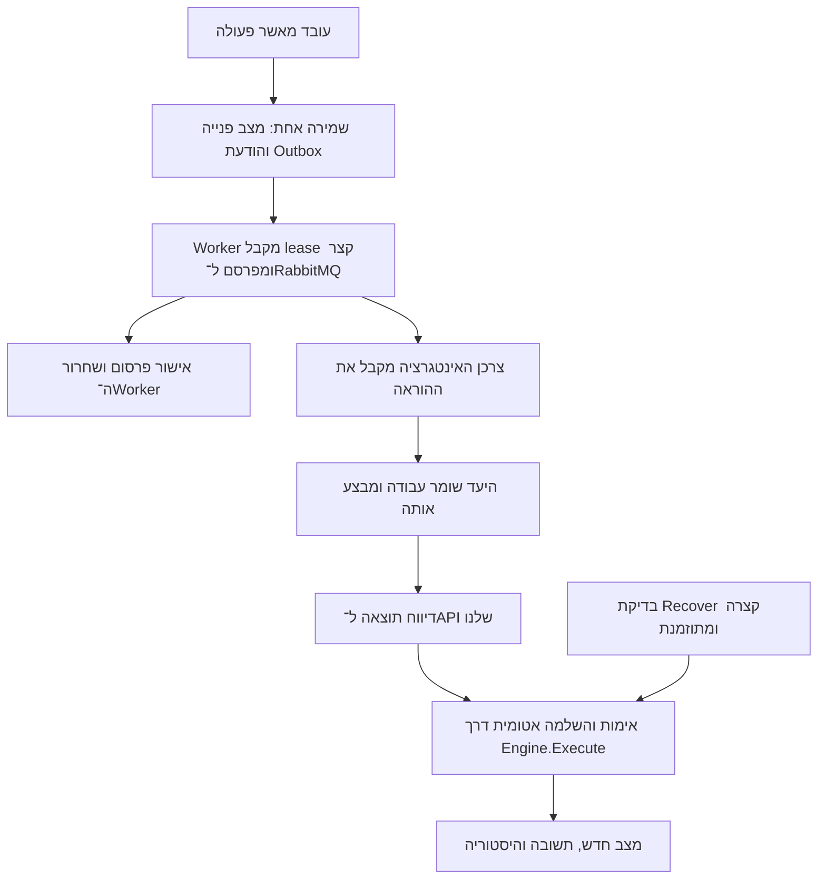

# תוכנית מימוש RabbitMQ ודיווח תוצאה ל־Workflow

תאריך: 8 באוקטובר 2026. מסמך תכנון בלבד; שום יכולת המתוארת כאן אינה נחשבת לממומשת או מוכחת עדיין.

המטרה היא לשחרר את משאבי מערכת הפניות אחרי שליחת הוראת ביצוע. תוצאת הפעולה תגיע מאוחר יותר ל־API ותפעיל את מעבר התוצאה במנוע הקיים. ההוכחה הראשונה תהיה מול RabbitMQ אמיתי ויעד מקומי נפרד עם נתונים דמיוניים.

## החלטות והיקף

| נושא | החלטה או הנחת תכנון |
|---|---|
| תור | RabbitMQ, כפי שנבחר בשיחה |
| קבלת תוצאה | callback ל־API שלנו; Recover תקופתי כגיבוי לפי המפרט |
| זיהוי | OperationId הקיים, שהוא מזהה הודעת ה־Outbox |
| אישור הדיווח | המלצה: CallbackToken סודי נפרד לכל פעולה; זו הנחת התוכנית, שעדיין דורשת אישור מפורש |
| המנוע | Engine.Execute והסמנטיקה של ההגדרות נשמרים |
| יעד ראשון | הדגמה מקומית נפרדת; אין חיבור למערכת ארגונית אמיתית |
| ספקים נוספים | ממשק פרסום קטן אחד, מימוש RabbitMQ בלבד; לא נבנה מימושים לספקים אחרים |
| ממשק משתמש | אין עיצוב מחדש או הרחבת עורך התהליכים; עדכון עקבי ומצומצם של תצוגת ההמתנה אם יידרש |

## המסלול המיועד

אישור RabbitMQ מעיד על פרסום, ולא על הצלחה עסקית. ה־lease שייך לניסיון שליחה קצר; ה־CallbackToken שייך לפעולה הממתינה. אין שמירת lease או הודעת RabbitMQ לא מאושרת לאורך המתנה של שעות או ימים.

## שלב 1 — להכין מסלול תואם לקיים

1. להפריד בתוך BusinessActions את בדיקות הפעולה, הפעלת היעד וקבלת התוצאה. פונקציית השלמה אחת תשמש מסלול סינכרוני, callback ו־Recover. היא תמשיך לקרוא ל־Engine.Execute הקיים.
2. לשמור על החוזים BusinessRequest, BusinessResult ו־BusinessHandler.Run/Recover. אין שימוש ב־Success=true כדי לייצג רק אישור קבלה.
3. להגדיר מיפוי תשתיתי של מפתחות BusinessAction שנשלחים לתור. כל מפתח אחר ממשיך במסלול הקיים. המיפוי אינו תלוי בשם התהליך, סוג המסמך או המשתמש.
4. הודעות קיימות ללא סימון משלוח אסינכרוני ממשיכות במסלול המקורי. רק הודעות חדשות שנוצרו עבור המיפוי החדש מקבלות את מעטפת ה־callback. אין העברה אוטומטית של הודעות ישנות למסלול החדש.

תוצר: אותם תהליכים וחוזי Adapter, עם נקודת השלמה משותפת ותבחין תשתיתי ברור למסלול החדש.

## שלב 2 — לשמור מידע עמיד על הפעולה

הצעה מצומצמת: להרחיב באופן אופציונלי את BusinessJob שבתוך Outbox.Message. אין הוספת מכונת מצבים עסקית שנייה או העתקת Case.State. המצב העסקי ממשיך להישמר בפנייה בלבד.

המידע הנוסף יכלול יעד/נתיב משלוח, גרסת מעטפת, token מוגן, hash לבדיקתו, זמן יצירה, זמן אישור פרסום, מועד בירור לוגי ותוצאת השלמה אם התקבלה. מקור האמת לתוצאה שהתקבלה אצלנו נשמר עם ה־Workflow באותה עסקה.

- ה־token נוצר ונשמר בעסקת יצירת ההוראה, לפני שהיא זמינה לשליחה. Envelope.OperationId נלקח ממזהה ה־Outbox אחרי השמירה.
- אותה פעולה שומרת אותו OperationId ואותו token גם אחרי restart וניסיונות פרסום חוזרים.
- token שנדרש לפרסום חוזר לא יכול להישמר כ־hash בלבד: נשמור עותק מוצפן/מוגן ושדה hash לאימות. מפתחות ההגנה חייבים לשרוד restart ולהיות נגישים למופעי המפרסם. ספק ההגנה האפמרלי של כניסת הדמו כיום אינו מתאים לכך; נוסיף הגנה עמידה נפרדת, בלי לשנות את כניסת המשתמשים.
- NextAttempt הקיים ישמש מועד ניסיון פרסום במצב pending, ומועד Recover הבא במצב awaitingResult. Attempts ימשיך לספור כשלי משלוח; בירור שעדיין אינו מחזיר תוצאה אינו ניסיון עסקי שנכשל.
- מצבי משלוח: pending → processing → awaitingResult → sent. sent ממשיך לציין שהפעולה העסקית הושלמה; mail/notification שומרים את המשמעות וההתנהגות הקיימות שלהם. blocked מציין צורך בבירור, ואינו מעבר עסקי של כישלון.
- נשמרים WaitingState, WaitingVersion, snapshot הקלט ו־Version של הודעת ה־Outbox. אין שינוי בפרסום גרסאות התהליכים.

אם במהלך המימוש יתברר שחסר שדה למסד לצורך שאילתה או אינדקס, נוסיף רק את השדה הנדרש ומיגרציה תואמת SQL Server/DemoUpgrade. לא נוסיף טבלת Workflow נוספת.

## שלב 3 — לפרסם ל־RabbitMQ בלי להמתין לתוצאה

1. להוסיף ב־Infrastructure ממשק בעל פעולה אחת: פרסום מעטפת בקשה עם CancellationToken. המימוש יכיר את RabbitMQ; המנוע לא יכיר אותו.
2. להוסיף RabbitMQ.Client הרשמי, גרסה נתמכת שתיקבע ותינעל בזמן המימוש. להשתמש בחיבור ארוך חיים וניהול channel בטוח למקביליות. לא לשתף channel בין מפרסמים מקבילים באופן לא מוגן.
3. להקים exchange ותור עבודה durable יחיד להוכחה הראשונה, עם הודעות persistent, publisher confirms ו־mandatory לפרסום. רק confirm בלי החזרה של הודעה בלתי ניתנת לניתוב ייחשב לאישור פרסום. נגדיר timeout קצר לאישור הפרסום; הוא אינו timeout של הפעולה העסקית.
4. מעטפת הבקשה תכיל Version, ActionKey, BusinessRequest הקיים, CallbackToken וכתובת callback מאושרת. נתיב היעד וכתובת callback מגיעים מתצורת השרת, ולא מקלט חופשי של מגיש הפנייה.
5. לאחר אישור הפרסום, עדכון מותנה ב־ClaimId/lease/Version יעביר ל־awaitingResult וישחרר את הבעלות. אין Engine.Execute בשלב זה. מסלול ההתראות נשאר עצמאי.
6. כשל פרסום מפעיל את backoff והחסימה אחרי חמשת הכשלים הקיימים. confirm שאבד עלול לגרום לפרסום כפול: אותו מזהה ואותו token נשמרים. לא מניחים עסקה משותפת בין SQL ל־RabbitMQ.

**מרוץ חשוב:** callback יכול להגיע כשההודעה אצלנו עדיין processing, לפני שמירת אישור הפרסום. מקבל התוצאה יוכל להשלים פעולה אסינכרונית מוכרת גם במצב זה. המפרסם לא יוריד sent בחזרה ל־awaitingResult. אם התקבלה תוצאה תקפה אחרי פרסום שתוצאתו הייתה לא ידועה, היא גוברת על ניסיון משלוח או חסימת משלוח מאוחרים.

RabbitMQ מבחין בין publisher confirms ובין consumer acknowledgements; אישור פרסום אינו אישור ביצוע. פרסום חוזר אחרי אובדן confirm דורש צרכן שמטפל בכפילויות. מקורות: [אישורים](https://www.rabbitmq.com/docs/confirms), [אמינות](https://www.rabbitmq.com/docs/reliability), [לקוח .NET](https://www.rabbitmq.com/client-libraries/dotnet-api-guide).

## שלב 4 — לקבל תוצאה ב־API מאובטח

נתיב מוצע: POST /integrations/business-actions/{operationId}/result. גוף הבקשה נושא CallbackToken ו־BusinessResult הקיים; אינו מאפשר לבחור מצב יעד או מעבר Workflow.

1. להפריד endpoint אינטגרציה מאימות המשתמשים האנושיים. קבוצת /api הקיימת מחייבת Account ותפקיד עסקי, ולכן לא נעקוף את ההגנות שלה ולא ניתן למערכת חיצונית משתמש Admin.
2. לפני ייצור, להגדיר עם צוות התשתיות זהות מכונה מוגבלת ליעד ולדיווח תוצאה בלבד, באמצעות מנגנון ארגוני נתמך כגון JWT ייעודי או mTLS. בהוכחה המקומית יהיה אימות נפרד ומוגבל לפיתוח, שלא ניתן להפעילו בייצור; אין סודות בקוד או בדוח.
3. לאמת את זהות המדווח, התאמתו ליעד הפעולה ואת ה־token בהשוואה בטוחה. להגביל גודל בקשה ולקבל רק מבנה תוצאה תקין. לא לרשום token בלוגים ולא להעבירו ב־URL.
4. לבדוק פעולה, WaitingState, WaitingVersion והגדרת התהליך המקובעת לפנייה. היעד המדווח אינו קובע את המעבר; Spec.Success/Failure הקיימים קובעים אותו.
5. לשמור באותה עסקה את השלמת הפעולה, מעבר המנוע, התוצאה, ההיסטוריה והודעות ההמשך. להשתמש ב־Version כדי שרק אחד מבין callback ו־Recover ישלים את הפעולה.
6. אותו דיווח תקף עם אותה תוצאה לאחר השלמה מחזיר 200 בלי מעבר נוסף. תוצאה סותרת או פעולה שאיבדה תוקף מחזירות 409. טוקן/זהות לא תקינים נדחים. תקלה זמנית בשמירה לא תחזיר הצלחה, כדי שהמדווח ינסה שוב.

ה־token אינו נצרך בניסיון פרסום ואינו מוחלף עם lease. השלמה מונעת פעולה חוזרת, אך מאפשרת אישור חוזר לדיווח זהה. timeout לוגי כשלעצמו אינו מבטל token של פעולה שעדיין ממתינה לתוצאה. הנחיות אבטחה: [OWASP REST Security](https://cheatsheetseries.owasp.org/cheatsheets/REST_Security_Cheat_Sheet.html).

## שלב 5 — Recover מתוזמן ובירור זמן המתנה

- סורק קצר בוחר רק פעולות אסינכרוניות שמועד בדיקתן הגיע, עם claim קצר ונפרד לבירור. הוא לא מחזיק Worker בין הבדיקות.
- Recover הקיים מחזיר Receipt ותוצאה סופית: מפעילים את אותה השלמה כמו callback. אין Receipt: שומרים את מועד הבדיקה הבא ומשחררים את המשאב. null אינו מוכיח שהפעולה לא התחילה או נכשלה.
- חריגה ממועד הבירור הלוגי מפעילה קודם Recover. אם התוצאה עדיין אינה ידועה, הפעולה נשארת ממתינה/דורשת בירור, ללא מעבר businessFailure שרירותי וללא ביצוע חוזר לא בטוח.
- פעולה אסינכרונית שנשלחה לא נקראת שוב באמצעות Run בצד מערכת הפניות. מניעת כפל ביצוע היא אחריות החוזה וה־Receipt אצל היעד; אין הבטחת exactly-once כללית מהתור או מה־token.
- Recover חייב להיות קריאת בירור קצרה ומוגבלת בזמן גם כשהעבודה עצמה אורכת ימים. אם ספק אמיתי אינו יכול לספק זאת, זה פער אינטגרציה לתיעוד ולהכרעה.

## שלב 6 — יעד הדגמה נפרד

להוסיף consumer/יעד הדגמה בתהליך נפרד ממערכת הפניות, עם מסד נתונים נפרד. הוא יקבל מעטפת RabbitMQ, ישמור את העבודה באופן עמיד ורק אז יבצע consumer ack. אין להחזיק הודעת RabbitMQ לא מאושרת בזמן המתנה ממושכת.

העבודה המקומית תישמר עם OperationId ייחודי ובדיקת התאמה לקלט. תזמון מוכנות ותוצאת עבודה יישמרו ב־DB של היעד ויחודשו אחרי restart. נשמרת האטומיות של עדכון הכתובת ו־Receipt ב־LocalAddressTarget. Run/Recover הקיימים נשארים חתומים כפי שהם; נוסיף מעטפת ותזמון סביבם, ולא לוגיקה של כתובת במנוע.

מצבי ההוכחה: normal, reject, interruptOnce, slow, והשהיית/אובדן callback. slow ידגים המתנה עמידה עד מועד מוכנות; מערכת הפניות לא מחזיקה Task.Delay או slot במהלך ההמתנה. גם תוצאת callback שטרם נמסרה תישמר ביעד ותישלח מחדש אחרי כשל או restart. Recovery של היעד ישתמש ב־Receipt כאשר שינוי בוצע לפני קריסה.

לפני חיבור ליעד אמיתי יש להסכים מי מפתח ומפעיל consumer/רכיב אינטגרציה זה. דמו נפרד מוכיח את החוזה, ולא מהווה התחייבות שצוות היעד האמיתי יספק אותו.

## שלב 7 — בדיקות קבלה ונסיגה

| תרחיש | ההוכחה הנדרשת |
|---|---|
| פרסום | הודעה מגיעה ל־RabbitMQ; הפנייה ממתינה; slot המפרסם משתחרר |
| תור חסר/בלתי ניתן לניתוב | אין סימון פרסום מוצלח; יש retry/backoff |
| RabbitMQ אינו זמין ואז חוזר | מצב הפנייה וה־Outbox נשמרים; השליחה מתאוששת |
| confirm אבד או שרת קרס אחרי הפרסום | פרסום כפול אפשרי, אך עדכון היעד מתבצע פעם אחת |
| callback תקין של הצלחה/כישלון | מעבר configured דרך המנוע, תוצאה והיסטוריה נשמרים |
| callback הגיע לפני שמירת אישור הפרסום | התוצאה אינה אובדת ואין חזרה מ־sent ל־awaitingResult |
| callback כפול או callback מול Recover במקביל | השלמה והיסטוריה אחת; דיווח זהה מאושר שוב ללא ביצוע נוסף |
| טוקן שגוי, יעד אחר או תוצאה סותרת | דחייה ללא שינוי פנייה |
| פנייה השתנתה/חזרה לאותו מצב | WaitingVersion דוחה פעולה ישנה |
| פעולה בוצעה וה־callback אבד | Recover קורא Receipt, בלי ביצוע חוזר |
| אין תשובה אחרי timeout לוגי | קודם בירור; אין כישלון עסקי או Run חוזר שרירותיים |
| המתנה ו־restart | השרת, היעד ומפתחות הטוקן שורדים; הפעולה משלימה מאוחר יותר |
| צרכן קיבל עבודה ואז קרס | העבודה העמידה ביעד וה־Receipt מאפשרים המשך ללא כפילות |
| כמה פעולות ממתינות לאורך זמן | לא תופסות slots של המפרסם; התראות ומשלוחים נוספים מתקדמים |
| תהליכים סינכרוניים וישנים | ללא שינוי בחוזים, guards, הרשאות, מסמכים או משמעות הפעולות |

נריץ מול RabbitMQ אמיתי בסביבה מבודדת. טיימרים קצרים בבדיקות יוכיחו את אותו מנגנון ששומר מועדים של שעות/ימים; לא נטען שהמתנו ימים בפועל. לפחות בדיקת callback אחת תבוצע מתהליך היעד הנפרד, ולא באמצעות שינוי סטטוס ישיר ב־DB.

נריץ את בדיקות התשתית וה־API הרלוונטיות ואת ה־E2E הקיים בהתאם לזמינות סביבת ההרצה. שלושת הסקריפטים הישנים integration/organization/payload כיום מניחים ש־Admin יוצר פנייה ונכשלים גם בגרסה הקודמת. נדרש עדכון fixtures לזהות מורשית לפני שאפשר לדרוש שכולם יהיו ירוקים; אין החלשת הרשאות או ביטול assertions. מגבלת spawn EPERM נשמרת ומדווחת אם עדיין חוסמת הרצה.

## קבצים צפויים

| מקום | שינוי מתוכנן |
|---|---|
| Infrastructure/BusinessActions.cs | הפרדת שליחה/השלמה; הרחבה אופציונלית של BusinessJob; השלמה משותפת |
| Infrastructure/OutboxLease.cs | מעבר fenced ל־awaitingResult, והגנות מפני callback במקביל |
| NotificationWorker.cs | פרסום קצר במסלול החדש; מסלולי הדואר והפעולות הקיימים נשמרים |
| Infrastructure/RabbitMqPublisher.cs | ממשק הפרסום ומימוש RabbitMQ ממוקד |
| Infrastructure/BusinessResultsApi.cs | endpoint ייעודי ואימות אינטגרציה |
| Infrastructure/BusinessRecoveryWorker.cs | בדיקות Recover קצרות לפי מועד שמור |
| Program.cs / Workflow.Api.csproj | רישום, תצורה ותלות RabbitMQ הרשמית |
| demo-target | תהליך הדגמה נפרד, שמירת עבודות ותוצאות callback |
| checks | קבלה, מירוצים, קריסות, הרשאות ונסיגה |

זו מפת עבודה, ולא דרישה ליצור כל קובץ אם אפשר לשמור אחריות ברורה בפחות קבצים. Engine.cs ועורך ההגדרות אינם יעד לשינוי.

## תנאים להפעלה והכרעות פתוחות

Docker מותקן במחשב לפי הבדיקה, אך פעילות Docker Engine עדיין לא נבדקה. RabbitMQ לא נמצא מאזין בפורט 5672. בשלב ההכנה נוודא הפעלת Docker, גישה לתמונת RabbitMQ ולחבילת NuGet, תצורה מקומית וסודות מחוץ לקוד. לא נפעיל תשתית כחלק ממסמך תכנון זה.

לפני מימוש יש לאשר את ה־token הנפרד ואת האחריות לתהליך היעד המדומה. לפני ייצור נדרשים: זהות מכונה, TLS והרשאות broker; אחריות לתפעול consumer; timeout/תדירות בירור; מפתחות הצפנה עמידים; התאוששות/גיבוי וניטור. RabbitMQ יחיד מקומי מוכיח את ההתנהגות, לא זמינות גבוהה בייצור.

OperationId מספרי נשאר מזהה ה־Outbox. לחיבור עתידי של כמה סביבות לאותו יעד נדרשת הפרדה לפי מקור/סביבה כדי למנוע התנגשות בין מזהים; זו החלטת חוזה לפני חיבור אמיתי, לא שינוי במזהי הפניות.

## סדר ביצוע ותנאי סיום

1. לאשר את חוזה ההודעה, ה־token ותהליך היעד; להכין RabbitMQ מבודד.
2. להוכיח השלמה משותפת עם המנגנון הקיים לפני שינוי השליחה.
3. לממש שמירה עמידה ופרסום בלבד, כולל confirm ואובדן confirm.
4. לממש callback ובדיקות כפילות/מירוצים.
5. לחבר יעד נפרד ו־Recover מתוזמן; להוכיח קריסה ותוצאה שאבדה.
6. להריץ נסיגה ו־E2E ולהגיש דוח עם PASS/FAIL/BLOCKED מפורשים.

Done רק כשפעולה אסינכרונית נשלחת לתור, המפרסם משתחרר, התוצאה המאומתת מקדמת את המנוע הקיים פעם אחת, המתנה ו־restart שורדים, והבדיקות מוכיחות זאת. אין הקמת Step Functions, fan-out, מערכת יעד אמיתית או עיצוב מחדש במסגרת ההוכחה הזו.
